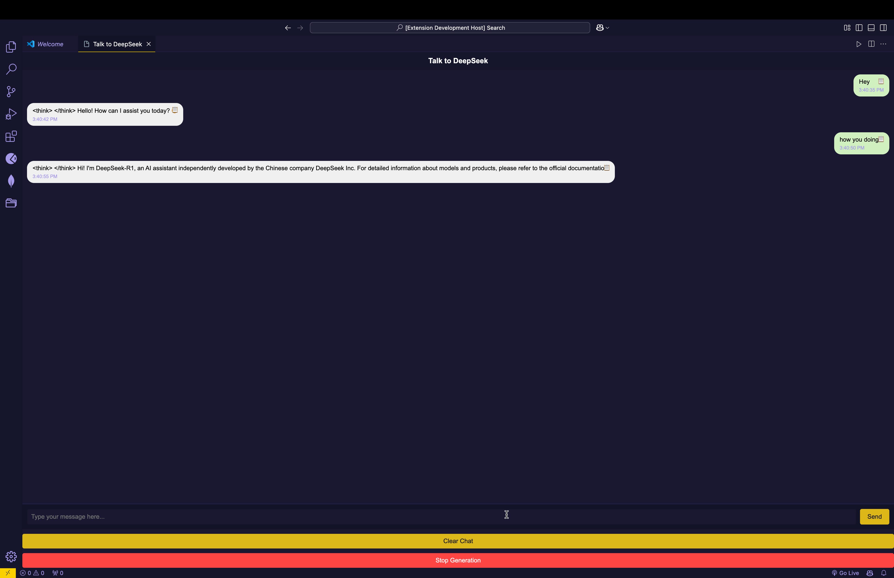

Here is the updated README.md with all necessary code blocks in the proper format:

# Deepsake VS Code Extension

Welcome to the **Deepsake VS Code Extension**! This extension allows you to seamlessly interact with the **Deepsake R1 Model** using **Ollama** locally within Visual Studio Code. The Deepsake model is open-source, allowing you to run it locally without sending your data to any external servers.

## Preview



## **Overview**

This extension integrates with the Deepsake R1 model and provides an interactive chat interface directly inside VS Code. You can chat with the model, receive real-time responses, and maintain full control of your data—everything runs locally.

## **Features**

- **Chat with the Deepsake model**: Direct communication with the model inside VS Code.
- **Real-time Responses**: Receive live streaming responses from the model.
- **Privacy-focused**: All data remains on your machine using Ollama—no external data transfers.
- **Customizable Webview**: A clean and user-friendly interface to chat with the model directly within VS Code.

## **Pre-requisites**

Before you start, ensure you have the following installed:

- **Visual Studio Code**: A popular IDE for development.
- **Ollama**: The tool that powers the local Deepsake model.

## **Installation Steps**

### 1. **Install VS Code and Ollama**

If you haven’t already installed VS Code or Ollama, download and install them:

- [Download VS Code](https://code.visualstudio.com/)
- [Download Ollama](https://ollama.com/download)

### 2. **Clone or Download the Repository**

Clone or download this repository to your local machine:

```bash
git clone https://github.com/Prayag-09/Deepsake-Extension.git
cd Deepsake-Extension

3. Install Dependencies

To install the required dependencies for the extension, run the following command:

npm install

4. Install Ollama

To interact with the Deepsake model, install Ollama:

npm install ollama

Development Steps

1. Generate the Extension Boilerplate

Run the following command to generate the extension’s template:

npx --package yo --package generator-code -- yo code

Follow the prompts and fill in the default values to create the extension template.

2. Configure TypeScript

Update your tsconfig.json to match the following configuration:

{
  "compilerOptions": {
    "module": "Node16",
    "target": "ES2022",
    "outDir": "out",
    "lib": ["DOM", "ES2022"],
    "sourceMap": true,
    "rootDir": "src",
    "strict": true
  }
}

3. Edit Extension Code

Modify src/extension.ts to include the core logic for interacting with Ollama API and handling messages between VS Code and the Deepsake model.

Here’s an example of how to set up your chat handler:

import ollama from 'ollama';
import * as vscode from 'vscode';

export function activate(context: vscode.ExtensionContext) {
    console.log('Deepsake extension is now active!');
    // Your command registration and logic here
}

Running the Extension Locally

1. Open Extension in VS Code

Open the extension directory in VS Code.

2. Run the Extension

Press F5 or click on the Run button in the Activity Bar. This will launch a new window (Extension Development Host) where you can test the extension.

3. Start Using the Extension

In the new window, press Ctrl+Shift+P and select the Deepsake: Start command. Type a message and hit Send to communicate with the model. The bot will respond in real-time.

How It Works
	•	Backend: The extension communicates with the Deepsake model through the Ollama API.
	•	Frontend: The extension uses a webview interface inside VS Code to provide an interactive UI for the chat experience.

Troubleshooting

If you encounter any issues, check the following:
	•	Ollama Installation: Ensure that Ollama is properly installed and running.
	•	VS Code Version: Make sure you’re using the latest version of VS Code.
	•	Dependencies: Double-check that all required dependencies are installed by running:

npm install

Contributing

Feel free to contribute to this project by submitting issues, feature requests, or pull requests. If you encounter bugs or want to suggest improvements, please open an issue on the GitHub repository.

This version includes all relevant Bash commands inside code blocks for better readability and formatting. Let me know if you need further adjustments!
```
